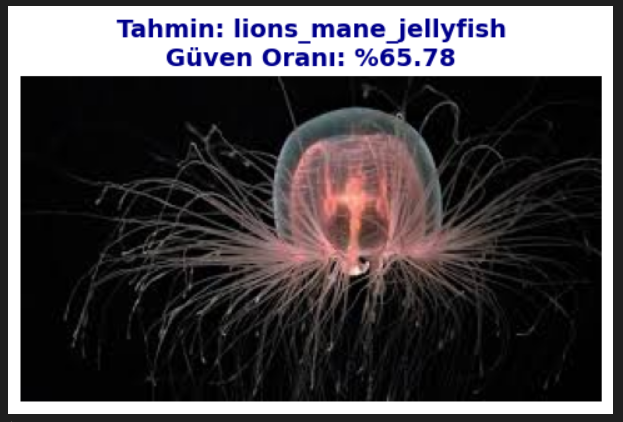
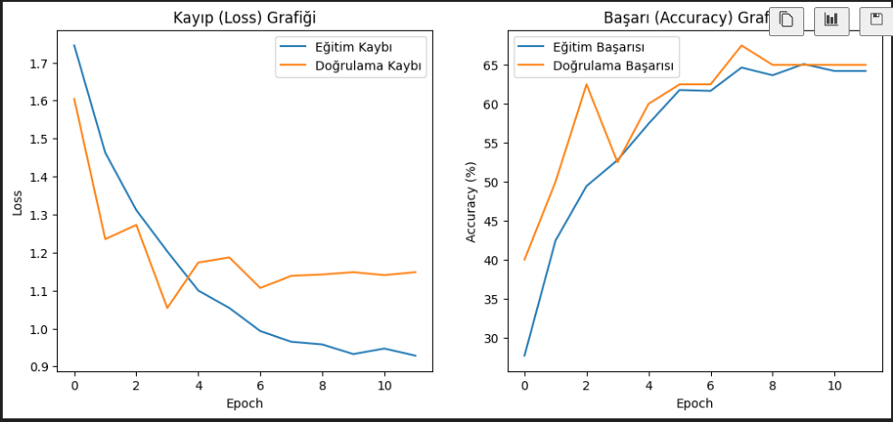

# 🪼 Jellyfish Classification (Deniz Anası Sınıflandırma)

> **🎯 Projenin Amacı**
>
> Denizlerin gizemli dünyasını yapay zeka ile keşfetmek!
> Bu proje, insan gözüyle ayırt etmesi zor olan farklı deniz anası türlerini, **Derin Öğrenme (Deep Learning)** ve **CNN** mimarilerini kullanarak yüksek doğrulukla sınıflandırmayı hedefler. Görüntü işleme tekniklerini modern yapay zeka algoritmalarıyla birleştirerek, deniz biyolojisi ve veri bilimi arasında akıllı bir köprü kurar.

---

## 🚀 Özellikler

Bu proje, modern bir yapay zeka uygulamasında olması gereken güçlü özelliklerle donatılmıştır:

* **🧠 Özel CNN Mimarisi:** Derinlemesine öğrenme için Conv2d, BatchNorm ve Pooling katmanları ile optimize edilmiş yapı.
* **🛡️ Aşırı Öğrenme Koruması:** `Dropout` ve `Weight Decay` teknikleri ile modelin ezber yapması engellenmiştir.
* **🔄 Veri Artırma (Data Augmentation):** Resimleri döndürme, çevirme ve renkleriyle oynama gibi tekniklerle model daha zorlu şartlara hazırlanmıştır.
* **⚙️ Otomatik Donanım Algılama:** Sisteminizde GPU (Ekran Kartı) varsa otomatik kullanır, yoksa CPU'ya geçer.
* **📊 Görsel Raporlama:** Eğitim sürecini gösteren detaylı Kayıp (Loss) ve Başarı (Accuracy) grafikleri çizer.
* **🖼️ Esnek Test İmkanı:** İster toplu test yapın, ister masaüstünüzden tek bir resim seçip anında sonucunu görün.

---

## 🖼️ Proje Örnekleri ve Görseller

Proje çalıştırıldığında elde edilen gerçek zamanlı sonuçlar ve analiz grafikleri aşağıdadır.

### 1. Gerçek Zamanlı Tahmin Örneği
Modelin, test verisetinden rastgele seçilen bir görüntüyü analiz edip türünü ve güven oranını tahmin ettiği an:

### 2. Eğitim Performans Grafiği
Modelin öğrenme süreci boyunca hata oranının düşüşünü (Loss) ve başarı oranının artışını (Accuracy) gösteren analiz grafiği:

---

## 📂 Veri Seti ve Yapı

Proje, `deniz_anasi` ana klasörü altında, her türün kendi ismini taşıyan alt klasörlerdeki görsellerle çalışır.
